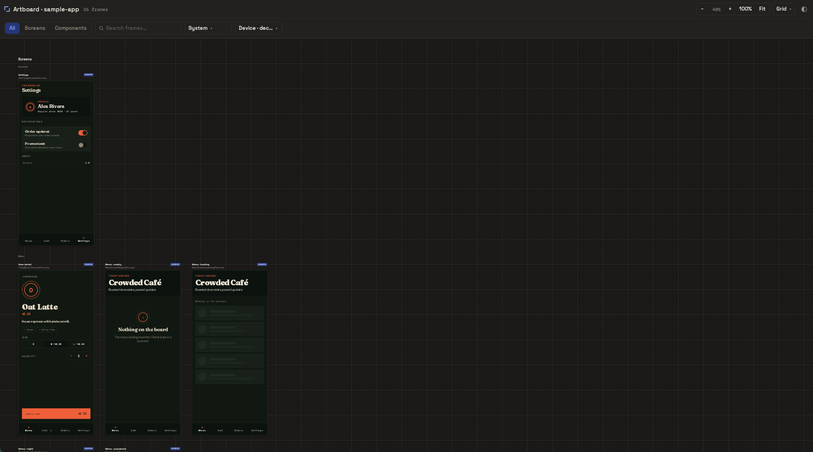

# Artboard

[](https://github.com/crowded-libs/artboard/actions/workflows/ci.yml)
[](https://central.sonatype.com/artifact/io.github.crowded-libs.artboard/artboard-gradle-plugin)
[](https://kotlinlang.org/)
[](https://www.jetbrains.com/compose-multiplatform/)

Artboard is a spatial browser gallery for Compose Multiplatform `@Preview`s.
It discovers previews with KSP, renders them on a pan-and-zoom Kotlin/Wasm
board, and gives every frame a stable URL-addressable ID.

[Try the live Crowded Café demo](https://crowded-libs.github.io/artboard/).



## Features

- Discovers stock Compose `@Preview` annotations, including repeat previews and
  both current and legacy Compose Preview packages.
- Renders every preview as a stable, deep-linkable frame on a pan-and-zoom
  board with mouse, trackpad, one-finger pan, and pinch-zoom navigation.
- Organizes frames into Screen and Component zones with search, group, device,
  locale, grid, and light/dark controls.
- Downloads the current state of any preview as a PNG, with native pixel sizes
  for the built-in device viewports.
- Generates a deterministic registry and JSON report; incompatible previews are
  listed with their reason instead of silently disappearing.
- Generates and serves an isolated Wasm host without colliding with a product
  Wasm entry point or changing a consumer’s target matrix.
- Exports an optimized, self-contained static gallery for GitHub Pages or any
  other static HTTP host.

## Use Artboard

Artboard releases are published to Maven Central. Add Maven Central to plugin
resolution, apply the plugin, and opt in to your own Wasm target:

```kotlin
pluginManagement {
    repositories {
        gradlePluginPortal()
        mavenCentral()
    }
}
```

```kotlin
plugins {
    kotlin("multiplatform")
    id("org.jetbrains.compose")
    id("org.jetbrains.kotlin.plugin.compose")
    id("io.github.crowded-libs.artboard") version "0.1.0"
}

kotlin {
    @OptIn(org.jetbrains.kotlin.gradle.ExperimentalWasmDsl::class)
    wasmJs { browser() }
}
```

Use stock Compose `@Preview` annotations, including previews declared in
`commonMain`. Artboard adds its KSP processor and runtime only to the Wasm
gallery graph; it never adds targets, platform `actual`s, or source-level
Artboard APIs to your application. A preview only needs to compile for your
consumer-declared `wasmJs` gallery target; it does not need to live in a
Wasm-specific source set.

```bash
./gradlew :ui:artboardDoctor
./gradlew :ui:artboardReport # build/reports/artboard/previews.json
./gradlew :ui:artboardRun
./gradlew :ui:artboardRunLan # test from another device on the local network
./gradlew :ui:artboardExport # build/artboard/export
```

`artboardRun` builds only the gallery’s Wasm graph and serves an isolated host.
`artboardRunLan` serves the same build on an explicitly exposed local-network
address in addition to loopback. It prints URLs that can be opened from another
device and warns that the development server is visible on the local network.
`artboardExport` creates the optimized production site without requiring a
long-running application server. Neither task builds Android or iOS targets.

## Theme-aware previews

The gallery light/dark control provides Compose's standard system-theme signal
to each preview. Artboard deliberately does not wrap preview content in its own
Material theme, so your application remains responsible for its design system.

To make a preview respond to the gallery toggle, wrap it in your normal app
theme and derive its mode from `isSystemInDarkTheme()`:

```kotlin
import androidx.compose.foundation.isSystemInDarkTheme

@Preview(name = "Account")
@Composable
fun AccountPreview() {
    AppTheme(darkTheme = isSystemInDarkTheme()) {
        AccountScreen(state = previewState)
    }
}
```

The theme wrapper and all of its dependencies must compile for the opted-in
`wasmJs` target. A preview that hard-codes light or dark mode remains valid, but
intentionally will not react to the gallery theme control.

## Download preview images

Each frame has a `PNG ↓` action that captures the preview body exactly as it is
currently composed. Camera position and zoom do not affect the image, and
Artboard chrome, selection marks, and layout grids are excluded.

Screen previews matching a built-in device viewport download at that device's
native pixel size and are flattened to an opaque background. Other screens and
components use a 2× logical-size fallback; component transparency is preserved.
Theme, locale, interaction state, and the current animation frame are included
in the capture.

Downloads render through the Wasm gallery. Native-sized images are convenient
for store artwork, but should still be checked against the Android or iOS app
before submission when platform rendering details matter.

## Develop Artboard

Requirements: JDK 17+, a WasmGC-capable browser, Android SDK for Android
showcase work, and Xcode for iOS showcase work.

```bash
# Core tests and runtime Wasm compilation
./gradlew test :artboard-runtime:jvmTest :artboard-runtime:compileKotlinWasmJs

# Fast consumer contract and gallery compilation
./gradlew -p samples/minimal artboardDoctor artboardReport compileKotlinWasmJs

# Café gallery, Android, and iOS verification
./gradlew -p showcase/cafe :shared:artboardExport
./gradlew -p showcase/cafe :androidApp:assembleDebug
./gradlew -p showcase/cafe :shared:iosSimulatorArm64Test :shared:linkDebugFrameworkIosSimulatorArm64
```

For UI or host changes, run the relevant `artboardRun`, open its printed URL,
check the browser console, and exercise the changed control. Keep screenshots
and verification artifacts under `/tmp`, never in the repository.

## License

Artboard is licensed under [Apache-2.0](LICENSE). Bundled font notices are in
[THIRD_PARTY_NOTICES.md](THIRD_PARTY_NOTICES.md).
